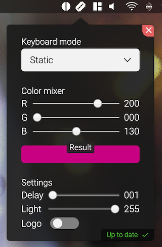

# RazerControl

This is a GUI, which resides in your menubar. The icon is a razor-blade, which is - as you may guess - a intended pun. It uses the amazing work of [kprinssu](https://github.com/kprinssu/osx-razer-blade) which then has been forked by [dylanparker](https://github.com/dylanparker/osx-razer-led), who added the command line functionallity. My software then executes the needed shell commands.



## Installation

This is **not** a finished package *yet*, so you'll have to just download the repo and execute it with the following command:

```bash
electron app.js
```

As already stated, this needs the dependency *osx-razer-led*, compiled (which you can easily do in xcode) as a binary in */usr/local/bin*. Don't forget to make it executable, by running *chmod +x osx-razer-led*. You can download precompiled binaries [here](https://github.com/dylanparker/osx-razer-led/releases).

## Future plans

- [x] Add a visual for sending commands
- [ ] Make the settings persistent over re-launch
- [ ] Keeping the right order in dropdown item list
- [ ] Fix slider positioning (length)
- [ ] Add terminate button
